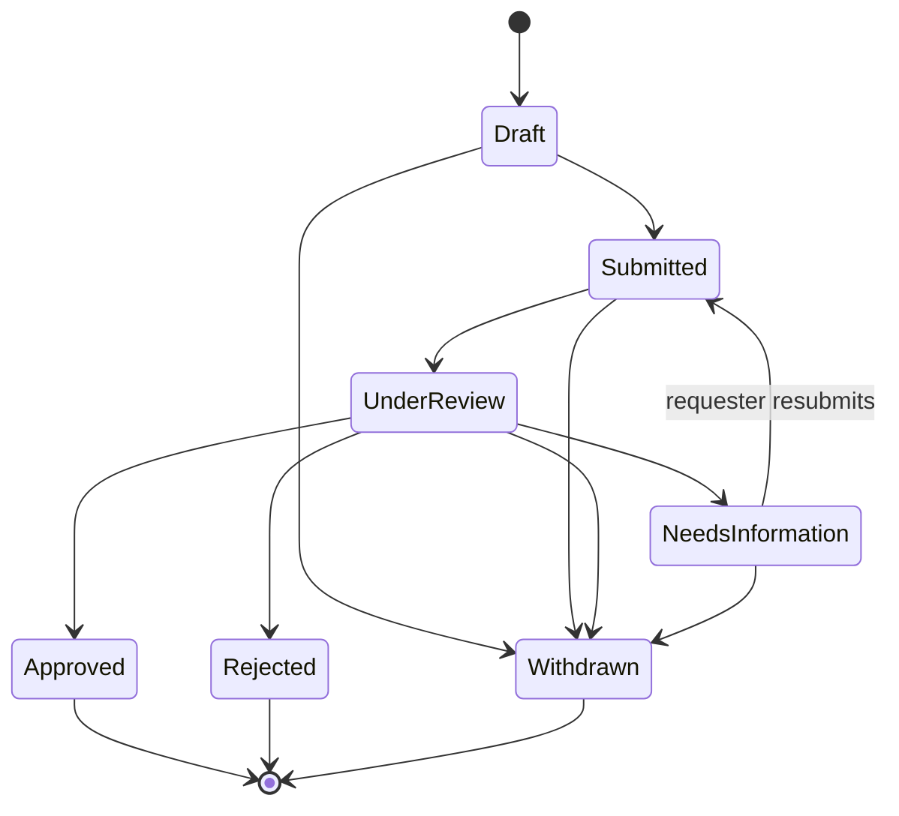
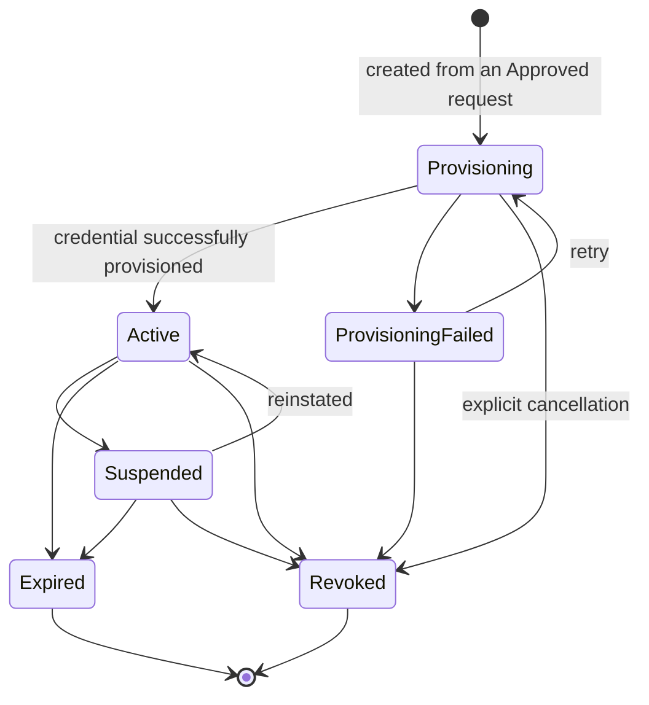
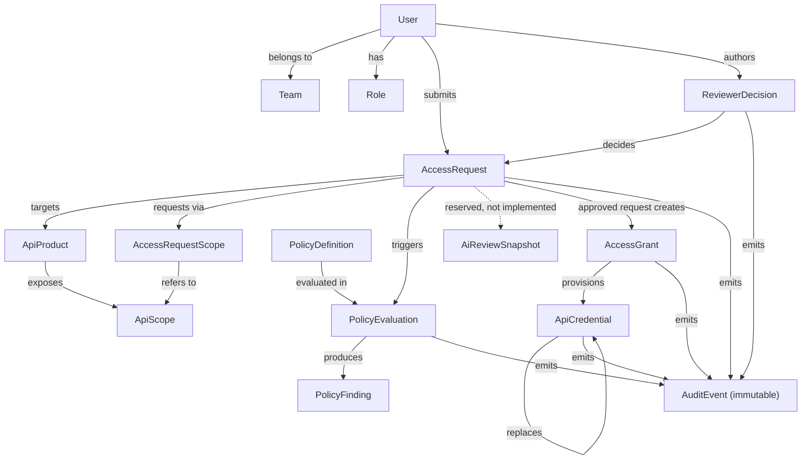

# API Access Console — Product Blueprint (Milestone 3)

This document defines the **product, UX, and domain scope** for Milestone 3. It is conceptual and does not describe implemented behavior — for what is actually built today, see [ARCHITECTURE.md](ARCHITECTURE.md), which documents the Milestone 1–2 baseline (PR #29) and the Milestone 3 target architecture side by side.

Nothing in this document has been implemented. No dependencies, migrations, sessions, or production UI exist yet as a result of it.

## Product scope

API Access Console is an internal tool for requesting, reviewing, granting, and managing access to internal APIs. Milestone 3 defines the target product so that persistence (Drizzle/Neon), authorization (Auth.js), and provisioning can be designed against a single, consistent domain model instead of being improvised feature-by-feature.

**In scope for the Milestone 3 blueprint:**
- Role-aware request submission and review workflow
- Distinct request, grant, and credential lifecycles
- Deterministic policy evaluation as a first-class, inspectable step in review
- A reserved (not implemented) place for AI-assisted review advice
- An explicit, clearly-labeled demo-identity experience for a portfolio/demo context
- Immutable audit history across all lifecycle transitions

**Non-goals (Milestone 3 blueprint):**
- Implementing any of the above — this is documentation only
- Real third-party identity providers or production authentication
- Real external API provisioning integrations
- Notifications, multi-tenant/org support, or fine-grained per-resource ACLs beyond the role-based permission matrix below

## Roles

| Role | Description |
| --- | --- |
| **Requester** | Submits access requests and views their own request/grant/credential status. Cannot review or decide on any request, including their own. |
| **Reviewer** | Reviews pending requests, sees deterministic policy findings, and approves, rejects, or requests more information on a request. |
| **Security Reviewer** | A Reviewer with additional authority over sensitive/high-risk requests (e.g. a privileged `ApiScope`, production environment) and credential lifecycle actions (suspend/revoke). |
| **Administrator** | Full operational authority: all Reviewer/Security Reviewer capabilities, plus grant/credential management, audit log access, and sandbox testing. |

## Permission matrix

| Action | Requester | Reviewer | Security Reviewer | Administrator |
| --- | :---: | :---: | :---: | :---: |
| Submit access request | ✅ | ✅ | ✅ | ✅ |
| View own requests/grants/credentials² | ✅ | ✅ | ✅ | ✅ |
| Resubmit an owned `NeedsInformation` request² | ✅² | ✅² | ✅² | ✅² |
| View all requests | — | ✅ | ✅ | ✅ |
| View deterministic policy findings² | — | ✅ | ✅ | ✅ |
| Approve/reject a request, or request more information | — | ✅¹ | ✅¹ | ✅¹ |
| Approve/reject a `production`-environment or privileged-scope request | — | — | ✅¹ | ✅¹ |
| Retry failed grant provisioning | — | — | ✅ | ✅ |
| Rotate a credential | — | — | ✅ | ✅ |
| Suspend/revoke a grant or credential | — | — | ✅ | ✅ |
| View audit log | — | — | — | ✅ |
| Access sandbox testing | — | — | — | ✅ |

¹ A user can never decide on a request they themselves submitted, regardless of role (self-approval prevention — enforced server-side, see [ARCHITECTURE.md](ARCHITECTURE.md)).
² Ownership is independent of role. Any authenticated owner may view their own request/grant/credential status and resubmit an owned `NeedsInformation` request, regardless of which role(s) they hold elsewhere. Conversely, Reviewer-tier permissions in this table (policy findings, deciding, requesting more information) apply only when acting on a request owned by someone else — an owner never sees policy findings on their own request, no matter what role they hold.

## One-minute demo flow

1. Land on the demo-identity picker; select the **Requester** persona and submit a new access request (`Draft` → `Submitted`), choosing an API product and the scope(s) needed.
2. Submission triggers a `PolicyEvaluation`. Switch to a **Reviewer** persona; open the request and inspect the resulting deterministic `PolicyFinding`s alongside the request details.
3. An authorized reviewer approves the request (a **Security Reviewer** persona for production-environment or privileged-scope requests), recording a `ReviewerDecision`. Self-approval is blocked server-side regardless of role.
4. Approval immediately creates an `AccessGrant` in `Provisioning` — no usable access exists yet.
5. Provisioning succeeds and creates an `ApiCredential` in `Active`; the grant moves to `Active`.
6. The credential's plaintext secret is shown once, at creation time, and never shown or stored again.
7. Switch to the **Administrator** persona; a sandbox request using the credential succeeds, exercising the same enforcement path production traffic would use.
8. The Administrator revokes the grant — every nonterminal (`Active` or `Suspended`) credential under it is revoked automatically as a consequence; already-terminal credentials are left unchanged.
9. The same sandbox request now fails, since the credential is `Revoked`.
10. `/audit` shows the full, immutable transition history end to end: submission → policy evaluation → decision → provisioning → credential issuance → sandbox use → grant revocation → cascaded credential revocation.

## Lifecycles

`AccessRequest`, `AccessGrant`, and `ApiCredential` are deliberately separate entities with independent lifecycles — approving a request does not itself grant usable access, and a grant does not itself imply a live credential. This separation exists so each can be suspended, revoked, replaced, or expired without corrupting the history of the others.

*`AccessRequest` lifecycle — terminal states: Approved, Rejected, Withdrawn (immutable — no transition ever leaves any of them). Every transition into `Submitted`, including a resubmission from `NeedsInformation`, triggers a new `PolicyEvaluation`. A request only reaches `UnderReview` once that evaluation succeeds; a failed evaluation keeps it in `Submitted`, with an explicit error, until reevaluation succeeds.*

*`AccessGrant` lifecycle — terminal states: Expired, Revoked (immutable — no transition ever leaves either). A grant can be revoked from any nonterminal state, including during `Provisioning`/`ProvisioningFailed` (explicit cancellation), not only once `Active`. No usable access exists while `Provisioning`/`ProvisioningFailed`. Revoking a grant revokes every nonterminal (`Active` or `Suspended`) credential under it; `Expired`, `Revoked`, and `Replaced` credentials are left unchanged (see Critical failure and edge states).*

```mermaid
stateDiagram-v2
    [*] --> Active: created only on successful provisioning; plaintext shown once
    Active --> Suspended
    Suspended --> Active: reinstated
    Active --> Expired
    Suspended --> Expired
    Active --> Revoked
    Suspended --> Revoked
    Active --> Replaced: rotation issues a new credential
    Suspended --> Replaced
    Expired --> [*]
    Revoked --> [*]
    Replaced --> [*]
```

*`ApiCredential` lifecycle — terminal states: Expired, Revoked, Replaced (all unusable, immutable — no transition ever leaves any of them). Rotation never mutates a credential in place: it creates a new `ApiCredential` that references the old one via `replaces`, and the old credential moves to `Replaced` — preserving an auditable replacement lineage. A credential is also rejected at enforcement time if its parent `AccessGrant` is not `Active` (see Credential security).*

## Credential security

From the user's perspective: a credential's plaintext secret is shown exactly once, at creation or rotation, with a copy action — it cannot be retrieved again afterward. Rotating a credential issues a brand-new secret as a new `ApiCredential` record; the old one stops working immediately. A credential also stops working the moment its parent grant is suspended, expired, or revoked, even if the credential record itself still shows `Active`. See [ARCHITECTURE.md](ARCHITECTURE.md#credential-security-boundaries-target) for how this is enforced.

## Core entity and relationship map

Conceptual only — no schema, columns, or Drizzle definitions. See [ARCHITECTURE.md](ARCHITECTURE.md) for how this maps to persistence.

- **User**: an individual with one or more `Role`s and a `Team`; demo personas are simply seeded `User` rows surfaced via the identity picker.
- **Team**: organizational grouping a `User` belongs to; carried onto `AccessRequest` for context.
- **Role**: drives the permission matrix (Requester, Reviewer, Security Reviewer, Administrator).
- **ApiProduct** / **ApiScope**: the thing being requested and the scope(s) it exposes; requests target one or more `ApiScope` selections rather than a flat access-level field.
- **AccessRequestScope**: join entity linking a request to the specific scope(s) it requests.
- **PolicyDefinition**: a static, named rule (e.g. "production environment + privileged scope requires Security Reviewer").
- **PolicyEvaluation**: one evaluation run against the applicable `PolicyDefinition`s, triggered on every submission and resubmission.
- **PolicyFinding**: deterministic pass/fail result produced by a `PolicyEvaluation` — never a human or AI decision.
- **ReviewerDecision**: one decision record per reviewer action (approve/reject/request-information); a request accumulates multiple across a `NeedsInformation` cycle.
- **AiReviewSnapshot**: reserved conceptual ownership for a future AI-generated advisory attached to a request. Not implemented, has no UI surface, and is deferred to Milestone 4.
- **AuditEvent**: immutable append-only record of every lifecycle transition across all entities, plus discrete events like a `PolicyEvaluation` run, a `ReviewerDecision`, and sandbox credential-usage attempts (success or failure) — never edited or deleted. A grant revocation and each nonterminal credential revocation it cascades to are recorded as separate `AuditEvent` entries.

## Sitemap and route responsibilities

| Route | Responsibility | Authorized access |
| --- | --- | --- |
| `/` | Role-aware dashboard: queue of requests/grants relevant to the signed-in identity | All |
| `/identities` | Demo-identity picker (session entry point) | All (pre-session) |
| `/requests/new` | Submit a new access request | All authenticated users |
| `/requests/[id]` | Request detail. Any authenticated owner (own request): status, `ReviewerDecision` history, resubmit action while `NeedsInformation` — policy findings stay hidden regardless of role. Reviewer+ reviewing someone else's request: additionally see policy findings and decision actions | Owner (own, read-only + resubmit), Reviewer, Security Reviewer, Administrator |
| `/grants` | List of grants and their lifecycle state | Owner (own, read-only), Security Reviewer, Administrator |
| `/grants/[id]` | Grant detail: provisioning status, retry action while `ProvisioningFailed`, suspend/revoke, linked credentials | Owner (own, read-only), Security Reviewer, Administrator |
| `/credentials` | List of credentials across grants | Owner (own, read-only), Security Reviewer, Administrator |
| `/credentials/[id]` | Credential detail: fingerprint, requested scopes, expiration, lifecycle status, replacement lineage, rotate/suspend/revoke actions | Owner (own, read-only), Security Reviewer, Administrator |
| `/audit` | Immutable audit event history | Administrator |
| `/sandbox` | Sandbox testing of a credential against a target API (non-production) | Administrator |

## Demo-identity entry experience

Because this project has no real user base, session entry is an explicit **demo-identity picker**, not a login form:

- `/identities` lists one seeded persona per role (Requester, Reviewer, Security Reviewer, Administrator).
- Selecting a persona establishes a session via Auth.js (target architecture), with no password or external identity provider involved.
- Every screen while in a demo session displays a persistent banner: *"Simulated identity — not a real account."*
- Demo identities are clearly out of scope for real authentication; they exist to make the reviewer workflow demonstrable end to end.
- Because demo sessions write through to shared seeded data, the system requires either a deterministic reset (e.g. scheduled or on-demand reseed) or per-visitor isolation (e.g. a session-scoped data partition), so public visitors cannot permanently corrupt the seeded workflows for other visitors. The specific mechanism is deferred to the persistence-foundation step (see Milestone 3 dependency order, step 3) — not decided in this document.

## Wireframes for primary workflows

Hierarchical region breakdowns, not pixel layouts. Each top-level bullet is a page region; nested bullets are the elements within it.

- **Dashboard (`/`)**
  - Header: app name, active identity badge, "Simulated identity" banner
  - Summary strip: counts by request status
  - Request/grant queue table (role-filtered), row → detail link
  - Empty state: "No items require your attention"

- **Intake (`/requests/new`)**
  - Form: API product, environment, requested `ApiScope` selection(s), justification
  - Inline validation feedback per field
  - Submit → pending confirmation state

- **Review detail (`/requests/[id]`)**
  - Request summary panel (requester, API product, environment, requested scope(s), justification)
  - Policy findings panel (deterministic, pass/fail per rule) — hidden from the request's owner regardless of role; visible only when a Reviewer, Security Reviewer, or Administrator is reviewing a request owned by someone else
  - Decision history panel (prior `ReviewerDecision` records, e.g. a `NeedsInformation` round) — visible to the owner on their own request
  - Decision actions: Approve / Reject / Request information, disabled entirely if the viewer is the request's owner
  - Resubmit action, shown only to the owner on their own request while it is `NeedsInformation`

- **Grants (`/grants`, `/grants/[id]`)**
  - Grant list: requester, API, status, linked request
  - Grant detail: lifecycle state, provisioning status, retry action while `ProvisioningFailed`, suspend/revoke actions, linked credentials list

- **Credentials (`/credentials`, `/credentials/[id]`)**
  - Credential list: linked grant, status, last rotated
  - Credential detail: fingerprint, requested scopes, expiration, lifecycle status, replacement lineage, rotate/suspend/revoke actions

- **Audit (`/audit`)**
  - Filterable, read-only event timeline (entity type, action, actor, timestamp), covering lifecycle transitions, policy evaluations, reviewer decisions, and sandbox credential usage

- **Sandbox (`/sandbox`)**
  - Credential selector
  - Simulated request/response panel against a mock target API

## UX and visual direction

- **Responsive hierarchy**: stacked cards on mobile, a collapsible two-column layout on tablet, and a full table plus side panel on desktop — the same data at every breakpoint, extending the existing accessible table/card pattern.
- **Enterprise density**: compact row heights and tight vertical rhythm in list/table views; whitespace is reserved for detail panels and forms, not used to pad out dense data.
- **Keyboard and focus**: every workflow is fully keyboard-operable with visible focus rings; opening/closing a detail panel moves focus deliberately, extending the existing `RequestDetailPanel` pattern to grants, credentials, and audit panels.
- **Status and risk indicators**: one consistent badge system for lifecycle status (`Draft` through `Revoked`/`Replaced`, etc.), and a visually distinct indicator for production-environment or privileged-scope requests.
- **Reusable states**: a single shared loading, empty, error, unauthorized, and conflict presentation reused across every route rather than bespoke per-page variants.
- **No unfinished surfaces**: no placeholder panel, disabled ghost feature, or "coming soon" affordance is ever shown — a capability is either fully present or entirely absent from the UI (this is why AI advisory has no visible surface in Milestone 3).

## Critical failure and edge states

| Scenario | Expected behavior |
| --- | --- |
| Requester attempts to approve/reject their own request | Blocked server-side; UI never exposes decision actions to the requester regardless of any other role they hold |
| Deterministic policy evaluation fails/times out | Request stays in `Submitted` (never moves to `UnderReview`); the latest `PolicyEvaluation` is marked failed, an explicit evaluation error is shown, and reviewer decision actions stay disabled until a successful reevaluation — no new request lifecycle state is introduced |
| Grant provisioning fails | Grant moves to `ProvisioningFailed`; an explicit retry action is available, and no usable access is ever implied while in this state |
| Two reviewers decide the same request concurrently | First decision wins; the second reviewer sees a stale-state error, not a silent overwrite |
| Request left unreviewed past its expected window | Surfaced distinctly from `Submitted`/`UnderReview`; never auto-approved or auto-rejected |
| Credential rotation overdue | Flagged on the dashboard and audit log; never auto-revoked without an explicit action |
| A grant is revoked | Every nonterminal (`Active` or `Suspended`) credential under it is revoked automatically; `Expired`, `Revoked`, and `Replaced` credentials are left unchanged. The grant's revocation and each credential's revocation are recorded as separate, immutable `AuditEvent` entries |
| Sandbox request presents a `Suspended`, `Expired`, `Revoked`, or `Replaced` credential | Rejected through the same enforcement path production traffic would use — no partial or soft-fail state |

## Milestone 3 dependency order

1. Product blueprint and target architecture (this document and the corresponding [ARCHITECTURE.md](ARCHITECTURE.md) section) — documentation only
2. Application shell and visual foundation
3. Neon and Drizzle persistence foundation
4. Auth.js sessions and server-only authorization, including self-approval prevention
5. Request intake and deterministic policy evaluation
6. Transactional decisions and immutable auditing
7. Grant provisioning and credential lifecycle
8. Sandbox enforcement, Vercel deployment, and critical Playwright coverage
9. AI review integration — deferred to **Milestone 4**, not scheduled as part of this milestone

## Deferred scope

- Actual AI model integration — only conceptual ownership (`AiReviewSnapshot`) is reserved; implementation is deferred to Milestone 4
- Real external API provisioning integrations
- Notifications (email/webhook/etc.)
- Multi-tenant/organization support
- Pagination beyond simple list views
- Fine-grained per-resource ACLs beyond the role-based permission matrix
